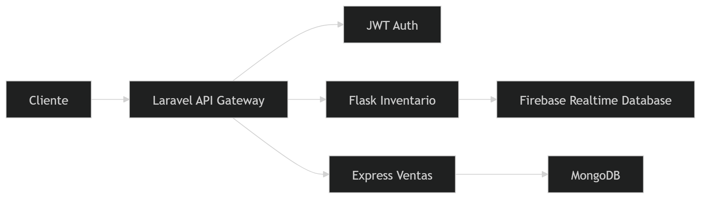
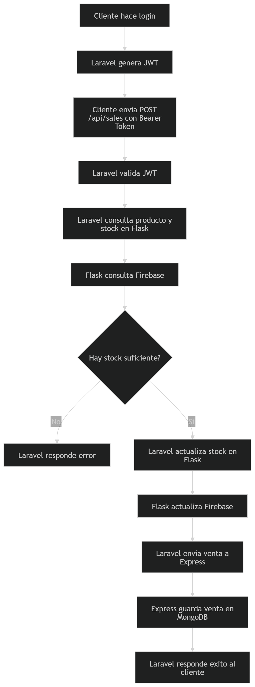

# Sistema de Ventas con Microservicios

Proyecto desarrollado para el taller de **Ingeniería de Software II**.

## Descripción

Este sistema implementa una **arquitectura basada en microservicios** para registrar ventas de una tienda.

## Tecnologías usadas

- **API Gateway:** Laravel 10  
- **Autenticación:** JWT  
- **Microservicio de Inventario:** Flask + Firebase Realtime Database  
- **Microservicio de Ventas:** Express + MongoDB  

## Arquitectura del sistema

El sistema está compuesto por **tres servicios principales**:

### 1. Laravel Gateway

- Gestiona autenticación con **JWT**
- Recibe solicitudes del cliente
- Orquesta la comunicación entre microservicios

### 2. Flask Inventario

- Registra productos
- Consulta productos
- Verifica stock
- Actualiza inventario después de una venta

### 3. Express Ventas

- Registra ventas
- Lista ventas
- Consulta ventas por usuario
- Consulta ventas por fecha

## Estructura del repositorio

taller-ventas-microservicios/
│

├─ gateway-laravel/

├─ ms-inventario-flask/

├─ ms-ventas-express/

│

├─ docs/

│  └─ informe.md

│

├─ README.md

└─ .gitignore

## Requisitos previos

Antes de ejecutar el sistema debes tener instalado:

- Git

- PHP

- Composer

- Python

- pip

- Node.js

- npm

- MongoDB local

- Cuenta de Firebase con Realtime Database

## Instalación

### 1. Clonar el repositorio

git clone https://github.com/BrahianStiven/Taller_ing

cd taller-ventas-microservicios 

### 2. Gateway laravel

cd gateway-laravel

composer install

copy .env.example .env

php artisan key:generate

php artisan jwt:secret

php artisan migrate

php artisan serve

**Configurar el archivo .env:**

APP_URL=http://127.0.0.1:8000

DB_CONNECTION=mysql

DB_HOST=127.0.0.1

DB_PORT=3306

DB_DATABASE=nombre_de_tu_basededatos

DB_USERNAME=root

DB_PASSWORD=

FLASK_BASE_URL=http://127.0.0.1:8001

EXPRESS_BASE_URL=http://127.0.0.1:3000

### 3. Microservicio flask (inventario)

cd ms-inventario-flask

pip install Flask firebase-admin

python app.py

**Archivo requerido:**

serviceAccountKey.json (Se debe de generar en la configuración de firebase y no se debe de hacer publico este archivo)

En **firebase_config.py** configurar:

DATABASE_URL = "TU_DATABASE_URL"

### 4. Microservicio Express (Ventas):

cd ms-ventas-express

npm install

npm start

**Configurar archivo .env:**

PORT=3000

MONGO_URI=mongodb://127.0.0.1:27017/ventas_microservicio

## Endpoints del gateway

### Autenticación
**Registrar usuario**

POST /api/register

Registra un usuario en el sistema.

**Login**

POST /api/login

Inicia sesión y devuelve un token JWT.

**Usuario autenticado**

GET /api/me

Devuelve los datos del usuario autenticado.

**Logout**

POST /api/logout

Cierra la sesión actual.

**Refresh token**

POST /api/refresh

Renueva el JWT.

### Ventas

**Registrar venta**

POST /api/sales

Registra una venta validando:

- JWT

- disponibilidad de stock en Flask

- guardado de venta en Express

**Listar todas las ventas**

GET /api/sales

**Ventas del usuario**

GET /api/sales/my-sales

Lista las ventas del usuario autenticado.

**Ventas por fecha**

GET /api/sales/date/{date}

## Flujo de registro de una venta

1. El cliente inicia sesión en el Gateway y obtiene un token JWT.

2. El cliente envía la solicitud de venta al Gateway.

3. Laravel valida el token JWT.

4. Laravel consulta el microservicio Flask para verificar disponibilidad de stock.

5. Flask consulta Firebase Realtime Database.

6. Si hay stock suficiente, Laravel actualiza el inventario en Flask.

7. Luego Laravel envía la información de la venta al microservicio Express.

8. Express registra la venta en MongoDB.

9. Express responde al Gateway.

10. Laravel responde al cliente.

## Diagrama de arquitectura

## Diagrama del flujo de venta

## Notas importantes

1. serviceAccountKey.json no debe subirse al repositorio.

2. Los archivos .env de Laravel y Express no deben subirse al repositorio.

3. MongoDB debe estar instalado y con el servicio iniciado.

4. Firebase Realtime Database debe estar creada y configurada.